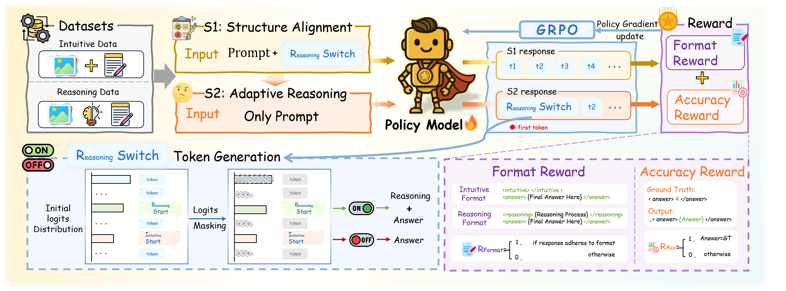

# GAR: GRPO-Driven Adaptive Reasoning for Vision-Language Models
## 📝 Abstract
Vision-Language Models (VLMs) excel in complex reasoning tasks but are often constrained by the issue of overthinking, limiting their applicability in real-world scenarios. Existing adaptive reasoning approaches face critical challenges, including data scarcity, catastrophic forgetting, and sensitivity to prompts. To address these limitations, we propose GRPO-Driven Adaptive Reasoning for VLMs (GAR), a novel reinforcement learning (RL)-based adaptive reasoning framework. GAR enables efficient reasoning in VLMs through a two-stage training process. In the first stage, the model generates outputs adhering to the formats of various reasoning paradigms via a multi-constraint output mechanism. In the second stage, constraints on first-token generation compel the model to adaptively select reasoning strategies based on task type and complexity. Experimental results show that GAR significantly reduces reasoning overhead while maintaining or surpassing the accuracy of existing methods, achieving a better balance between efficiency and accuracy. We will release the code, datasets, and model weights for reproducibility.




---

## 🔧 0. Before You Start

* Install your environment guided by [verl](https://verl.readthedocs.io/en/latest/start/install.html)
* Configure `PROJECT_ROOT`, `DATA_DIR`, `WANDB_*`, `CUDA_VISIBLE_DEVICES`, etc.
* Ensure Ray Dashboard is reachable at **[http://127.0.0.1:8265](http://127.0.0.1:8265)**.
* Replace `MODEL_NAME=/path/to/your/model-or-checkpoint` with your initial model.
* Update `trainer.project_name` and `trainer.experiment_name` — these define:

  * `outputs/<project_name>/<experiment_name>/checkpoints/`

---

## 🚀 1. Stage 1

```bash
bash examples/cvpr/qwen2.5-vl-fp16-stage1.sh
```

* Record the checkpoint marked as **best**.

---

## 🚀 2. Stage 1_1

```bash
bash examples/cvpr/qwen2.5-vl-fp16-stage1_1.sh
```

* Input the **best checkpoint** from Stage 1.
* Produces another **best** checkpoint.

---

## 🚀 3. Stage 2

```bash
bash examples/cvpr/qwen2.5-vl-fp16-stage2.sh
```

* Produces the **final best model**.

---

## 📌 4. Picking the Checkpoint Between Stages

* Check Ray logs or:

  * `outputs/<project_name>/<experiment_name>/checkpoints/`
* Choose the checkpoint you want to continue from (e.g., by `global_step`).
* Pass it to the next script as `MODEL_NAME`.

---

## ⚙️ 5. Customizing the Number of Skipped Steps

All scripts currently use:

```
trainer.start_from_global_step=250
trainer.skip_steps_before_start=250
```

To change them:

* Edit the scripts directly and modify the numbers.
* Or create local variants such as `*_custom.sh`.
* Keep both values synchronized to ensure correct logging.

---

Run the stages sequentially: **Stage1 → Stage1_1 → Stage2**, always feeding the previous stage’s best checkpoint into the next step to complete the Qwen2.5-VL FP16 three-stage workflow.

## Citation
```bibtex
@article{sheng2024hybridflow,
  title   = {HybridFlow: A Flexible and Efficient RLHF Framework},
  author  = {Guangming Sheng and Chi Zhang and Zilingfeng Ye and Xibin Wu and Wang Zhang and Ru Zhang and Yanghua Peng and Haibin Lin and Chuan Wu},
  year    = {2024},
  journal = {arXiv preprint arXiv: 2409.19256}
}
